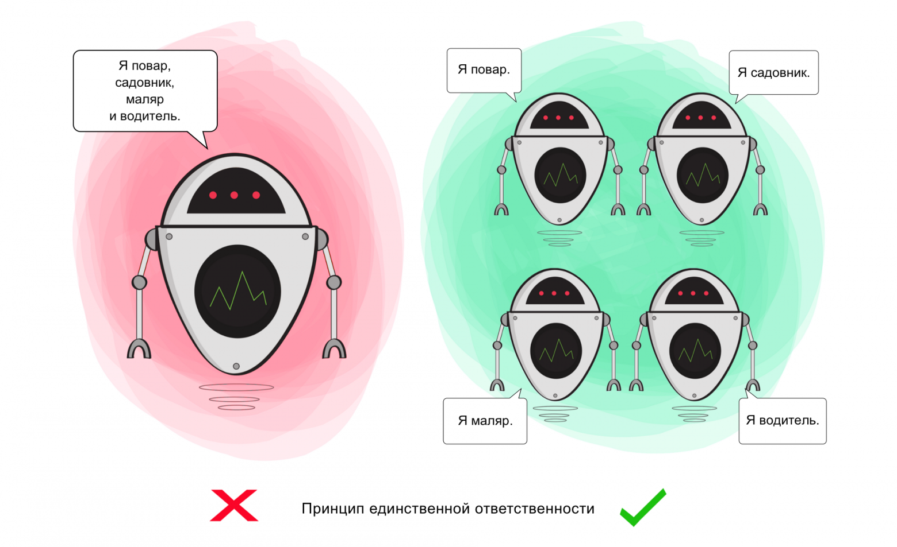

# SOLID
SOLID - это акроним, который описывает пять принципов объектно-ориентированного проектирования.

* S: **Single Responsibility Principle** (Принцип единственной ответственности).
* O: **Open-Closed Principle** (Принцип открытости-закрытости).
* L: **Liskov Substitution Principle** (Принцип подстановки Барбары Лисков).
* I: **Interface Segregation Principle** (Принцип разделения интерфейса).
* D: **Dependency Inversion Principle** (Принцип инверсии зависимостей).

# Принцип единственной ответственности
Каждый класс должен отвечать только за одну операцию.

Класс `Book` имеет единственную ответственность - **хранить информацию о книге и управлять состоянием книги** (взята на руки или нет). 

Класс `Library` имеет единственную ответственность - управлять коллекцией книг и обеспечивать взятие и возврат книг. 

Эти два класса могут быть использованы вместе в другой программе для создания системы управления библиотекой. 