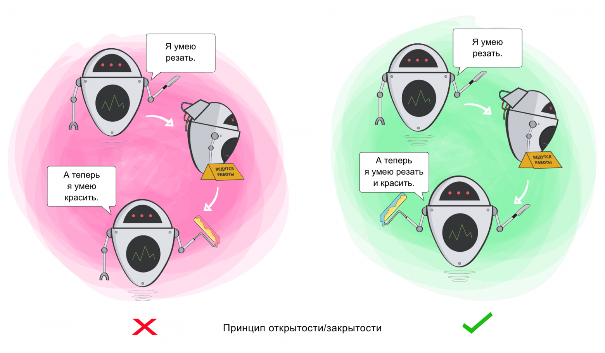

# Принцип открытости-закрытости

Принцип открытости/закрытости (Open/Closed Principle, OCP) из SOLID гласит, что классы должны быть открыты для расширения, но закрыты для изменения. 
Это можно достичь, используя интерфейсы или абстрактные классы.

Принцип служит для того, чтобы делать поведение класса более разнообразным, не вмешиваясь в текущие операции, которые он выполняет. 
Благодаря этому вы избегаете ошибок в тех фрагментах кода, где задействован этот класс.

Вот пример реализации классов `Library` и `Book` по принципу открытости/закрытости:

В данном примере, класс `Book` является абстрактным классом, который определяет интерфейс для реализации классом-наследником. 

Класс `Library` содержит список книг и методы для взятия и возврата книг, но он не знает какую именно реализацию книги он использует. 
Это позволяет добавлять новые типы книг в программу без изменения класса `Library`, при условии, что они реализуют интерфейс Book.
