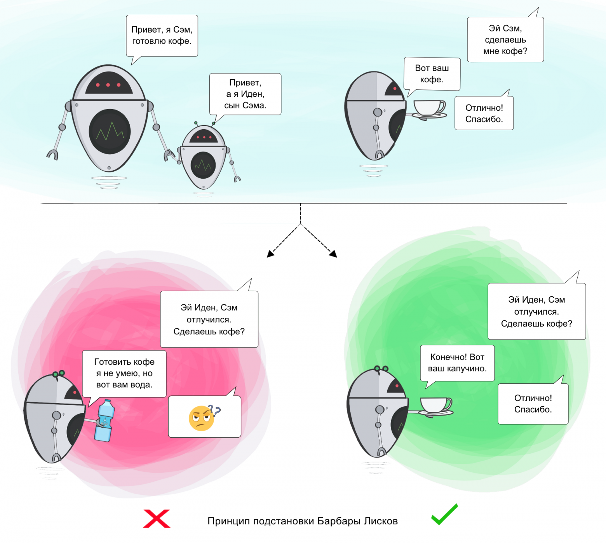

# Liskov Substitution (Принцип подстановки Барбары Лисков)
Если П является подтипом Т, то любые объекты типа Т, присутствующие в программе, могут заменяться объектами типа П без 
негативных последствий для функциональности программы.

В данном примере, мы создали класс `Audiobook` который так же наследуется от `Book` и реализует свои собственные методы `check_out` и `check_in`. 
Так же теперь мы можем добавлять новые типы книг в библиотеку без изменения класса `Library`, так как он использует интерфейс `Book`, 
который должен быть реализован всеми подклассами. 

Также можно заметить, что в классе `Library` мы используем методы `check_out_book` и `check_in_book`, которые ожидают ISBN книги, и ищут книгу в списке книг библиотеки и вызывают соответствующие методы из класса `Book`. 

Это делает код более гибким и соответствует принципу открытости-закрытости SOLID.