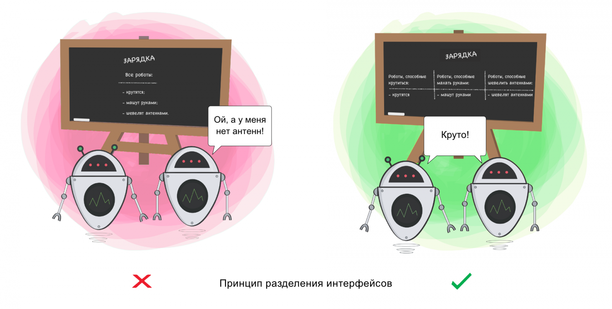

# Interface Segregation Principle (ISP)(Принцип разделения интерфейса).

Принцип служит для того, чтобы раздробить единый набор действий на ряд наборов поменьше – таким образом, каждый класс делает то, что от него действительно требуется, и ничего больше.

Принцип разделения интерфейса можно добавить, создавая различные интерфейсы для различных операций и реализуя их в соответствующих классах. 

Например, можно создать интерфейс `CheckOutable` для операции выдачи книги и интерфейс `CheckInable` для операции возврата книги. 

Затем можно реализовать эти интерфейсы в классах `PhysicalBook`, `Ebook`, `Audiobook` и т.д. 
Таким образом, мы можем определить точно, **какие методы должны быть доступны для каждого типа книги, и избежать использования методов, 
которые не имеют смысла для какого-либо типа книги**.

В данном коде, мы создали интерфейсы `CheckOutable` и `CheckInable`, которые определяют методы `check_out` и `check_in` 
соответственно, и реализовали их в классах `PhysicalBook`, `Ebook`, `Audiobook`. 
Затем мы изменили класс `Library` чтобы использовать эти интерфейсы для выполнения операций выдачи и возврата книг. 

Таким образом, мы можем быть уверены, что только книги, которые могут быть взяты на руки или возвращены, 
будут обрабатываться методами `check_out_book` и `check_in_book` класса `Library`. 

Таким образом, мы следуем принципу разделения интерфейса, гарантируя, что каждый класс имеет только необходимый интерфейс 
и отвечает только за свою ответственность.

