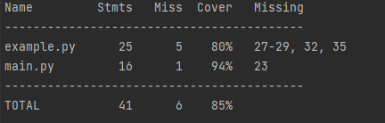
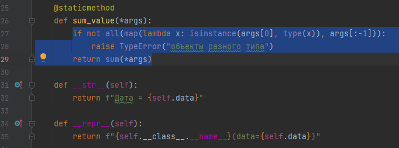

Пример использования модуля [coverage](https://coverage.readthedocs.io/en/stable/) с unittest:

Команда для запуска:

`coverage run -m unittest main.py`

Для отображения результатов:

`coverage report`

Для отображения результатов c пропущенными строками тестов:

`coverage report -m`

В графе Missing показываются строки, которые тесты не захватили

Можно совместить, чтобы не сохранялся файл `.coverage`

`coverage run -m unittest && coverage report -m`

Для того чтобы исключить из поиска определенные файлы, можно прописать
`coverage run -m --omit <название файла/пути до файла> unittest <название тестируемого файла>` 

Для того чтобы исключить из отчёта определенные файлы, можно прописать
`coverage report -m --omit <название файла/пути до файла>`

