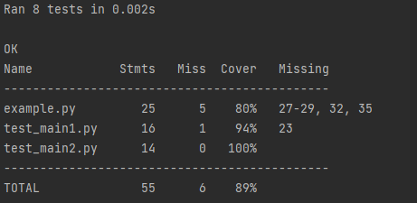

`coverage` позволяет просмотреть все `unittest` тесты в директории. Для этого необходимо, чтобы файлы с тестами назывались 
с имени `test_*.py`

Запуск необходимо производить в консоли и в той директории откуда `coverage` будет искать тесты

Команда для запуска:

`coverage run -m unittest`

аналогично для отображения результатов в консоль без создания файла `.coverage`
к команде дописывается `&& coverage report -m`

`coverage run -m unittest && coverage report -m`

для формирования html - аналогично

`coverage run -m unittest && coverage html`

При запуске получаем 

Хоть и тесты в файлах `test_main1.py` и `test_main2.py` одинаковые, но из-за того, что в test_main1.py есть блок `if __name__ == '__main__'`,
то `coverage` не даёт получить 100%

`coverage` позволяет запускать тесты из папок, это этого нужно сделать папку пакетом (добавить `__init__.py`), 
название папки может быть любым

процедура запуска стандартная, главное чтобы папки были пакетами.

При запуске получаем

для `coverage` путь до загружаемых файлов для тестирования должен быть в прямом доступе относительно директории запуска тестов

поэтому в файле `test/test_main3.py` , а также в `tmp/test_main4.py` и `tmp/tmp/test_main5.py`

используется 

`from example import SuperFunction`

вместо

`from ..example import SuperFunction`

чтобы иметь возможность запускать код из места расположения файла, то необходимо указать что папка является источником(source)

