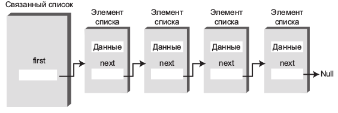
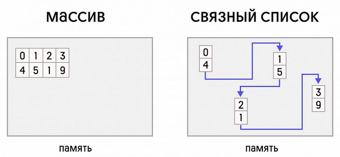
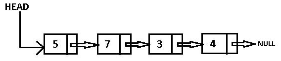
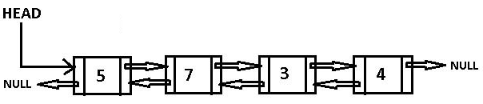
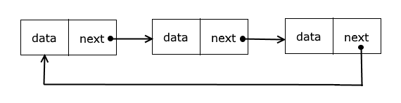

# Теоретическое задание (прочитать, запустить, ознакомиться с кодом)

В данном блоке будет рассмотрена структура `Связанный список` так как она в полной мере позволит раскрыть самостоятельное 
наполнение системных (магических) методов классов.

`Связанный список` — это структура данных, состоящая из узлов (элементов), где каждый узел хранит данные и ссылку на следующий узел в списке. 

Это отличие от массива, где элементы хранятся в смежных ячейках памяти и доступ к ним осуществляется по индексу. 
В связанном списке элементы не обязательно располагаются в памяти подряд, но каждый элемент "знает", где находится следующий.

## Виды связанных списков:

***Односвязный список***:

Каждый узел содержит данные и ссылку (указатель) на следующий узел.
Последний узел имеет ссылку, указывающую на None, что означает конец списка.

***Двусвязный список***:

Каждый узел содержит данные, ссылку на следующий узел и ссылку на предыдущий узел.
Это позволяет перемещаться по списку в обе стороны (вперёд и назад).

***Кольцевой список***:

В кольцевом **односвязном списке** последний узел указывает на первый узел, образуя круг.

В кольцевом **двусвязном списке** последний узел указывает на первый, а первый узел указывает на последний.

## Преимущества связанных списков:

* Гибкость в размере: Связанный список может динамически расширяться и сужаться, добавление и удаление элементов выполняется без необходимости перемещения других элементов, как это происходит в массиве.
* Эффективное добавление и удаление элементов: Вставка и удаление узлов могут быть выполнены быстро, если мы знаем место для вставки или удаления (например, вставка в начало или конец списка).

## Недостатки связанных списков:
* Медленный доступ по индексу: Чтобы получить элемент, приходится проходить по списку от начала до нужного узла, что занимает больше времени по сравнению с массивом, где доступ к элементу осуществляется мгновенно по индексу.
* Дополнительная память на указатели: Каждый узел требует дополнительной памяти для хранения указателя на следующий узел (и на предыдущий в случае двусвязного списка).