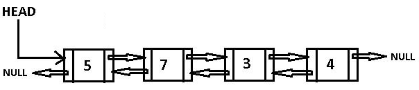

# Теоретическое задание (прочитать, запустить, ознакомиться с кодом)

Чтобы реализовать двусвязный список, нужно модифицировать узлы, чтобы каждый из них хранил ссылки как на следующий, так и на предыдущий узлы. Также нужно обновить методы для добавления элементов и другие операции, чтобы учитывать обе ссылки (вперёд и назад).

## Описание изменений относительно односвязного списка:

### Класс Node:

* Добавлена ссылка `prev`, которая указывает на предыдущий узел.

### Класс DoublyLinkedList:

* Реализован метод `append`, который теперь устанавливает не только ссылку на следующий узел, но и обратную ссылку на предыдущий узел.
* Метод `print_list_forward` позволяет проходить список в прямом порядке.
* Метод `print_list_backward` позволяет проходить список в обратном порядке, начиная с последнего узла.