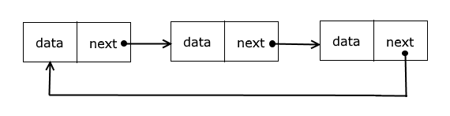

# Теоретическое задание (прочитать, запустить, ознакомиться с кодом)

В кольцевом односвязном списке последний узел не указывает на None, как в обычном односвязном списке, а ссылается на первый узел, замыкая список в кольцо. 
Эта структура полезна в сценариях, когда нужно циклически проходить элементы, например, для реализации кругового буфера или циклического списка задач.

## Описание работы кода:

### Класс Node:

* Как и в обычном односвязном списке, каждый узел содержит данные и ссылку на следующий узел.

### Класс CircularLinkedList:

* При добавлении первого узла он становится головным (head) и его ссылка (next) указывает на самого себя.
* При добавлении новых узлов, их ссылки (next) обновляются так, чтобы последний узел ссылался на head, формируя кольцо.

### Метод print_list:

* Для обхода списка используется цикл while True. Он завершает работу, когда снова возвращается к head, что означает полный обход списка.
* Для ясности вывода добавлено сообщение, указывающее, что список замкнут и мы вернулись к началу.