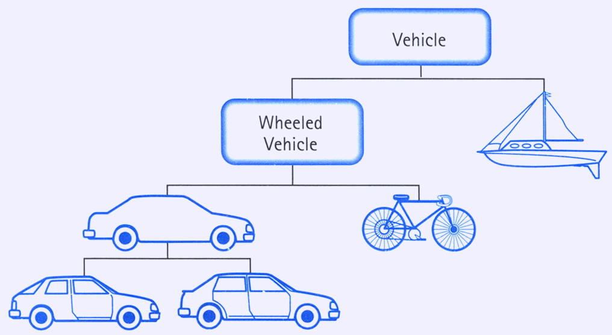

# Блок заданий по теме полиморфизм.

# Теоретическое задание (прочитать, запустить, ознакомиться с кодом)

## Что такое полиморфизм?

Полиморфизм — это один из основных принципов объектно-ориентированного программирования (ООП), который позволяет объектам 
разных классов обрабатывать данные одинаково. Проще говоря, полиморфизм позволяет использовать один и тот же интерфейс 
для разных типов объектов.

```python
class Animal:
    def speak(self):
        pass

class Dog(Animal):
    def speak(self):
        return "Woof!"

class Cat(Animal):
    def speak(self):
        return "Meow!"

def make_animal_speak(animal: Animal):
    print(animal.speak())

if __name__ == "__main__":    
    dog = Dog()
    cat = Cat()
    
    make_animal_speak(dog)  # Woof!
    make_animal_speak(cat)  # Meow!
```

В этом примере функция `make_animal_speak` принимает объект типа `Animal` и вызывает метод `speak`. 
Несмотря на то, что функция не знает, к какому конкретному классу принадлежит объект (`Dog` или `Cat`), 
она правильно вызывает соответствующий метод для каждого объекта.

## А что делать если хочу расширить метод дочернего класса, при этом оставив функциональность родительского метода?

В этом случае используется специальная функция `super`. 
`super()` — это встроенная функция в Python, которая позволяет обращаться к методам родительского класса. 
Основное предназначение `super()` заключается в том, чтобы обеспечить возможность вызова методов родительского класса в подклассе. 
Это особенно полезно в ситуациях, когда нужно расширить или переопределить поведение родительского класса в дочернем классе, 
сохранив при этом часть функциональности родительского класса.

**Пример использования super()**:

Рассмотрим пример с классами `Animal` и `Dog`. Допустим, Animal имеет метод `__init__`, который устанавливает общий атрибут для всех животных. 
В классе `Dog` мы можем использовать `super()`, чтобы вызвать `__init__` родительского класса и дополнить его дополнительными действиями.

```python
class Animal:
    def __init__(self, name):
        self.name = name
        print(f"{self.name} is an animal.")

class Dog(Animal):
    def __init__(self, name, breed):
        super().__init__(name)  # Вызов конструктора родительского класса
        self.breed = breed
        print(f"{self.name} is a {self.breed} dog.")

dog = Dog("Buddy", "Golden Retriever")
```

В этом примере `super().__init__(name)` вызывает конструктор родительского класса `Animal`, который выполняет свою часть работы (устанавливает имя животного). 
Затем дочерний класс `Dog` выполняет свою дополнительную работу (устанавливает породу собаки).

`super()` просто позволяет получить или вызвать что-то из родительского класса. Чаще всего его можно встретить в конструкторе `__init__`, 
но это может быть и любые другие методы и атрибуты.

При этом место вызова особо роли не играет, так как вызов функции просто выполняет действия из родительского класса.

```python
class A:
    def __init__(self, param_a):
        self.param_a = param_a

    def get_param(self):
        return self.param_a


    def print_value(self, value):
        print(value)


class B(A):

    def __init__(self, param_a, param_b):
        super().__init__(param_a)  # Здесь я хочу, чтобы вызвался родительский __init__ и создались теже
        # атрибуты, что и у родителя
        self.param_b = param_b  # Создаётся свой атрибут специфичный для этого класса

    def get_param(self):
        """Расширяем метод get_param, возвращает тоже
        что возвращал self.param_a, но с улучшениями
        """
        print("Вот это моё улучшение")
        # Таким образом возвращается то, что вернется после вызова родительского метода.
        # Важно что все данные в метод для super() подставятся из класса B, а не из A
        return super().get_param()

    def print_value(self, value):
        super().print_value(value)  # Вызывается родительский метод
        print("Новый функционал")


if __name__ == "__main__":
    b = B(10, 20)
    print(b.get_param())
    b.print_value(30)
```


## Пример 

Теперь рассмотрим более приближенный к реальности пример.

Допустим, у вас есть класс `Vehicle`, который описывает общее транспортное средство. 
В нашей упрощенной реализации разобьем дальнейшую иерархию на Лодку (`Boat`) и Колесное Транспортное Средство (`Wheeled Vehicle`).
`Wheeled Vehicle` далее можно разбить на Машину (`Car`) и Велосипед (`Bicycle`), а Машину разобьем на Купе (`Coupe`) и Седан (`Sedan`).

Данная иерархия носит исключительно информационный характер, остановимся на ней. 



```python
class Vehicle:
    """Базовый класс для всех транспортных средств."""
    def __init__(self, name):
        self.name = name

    def move(self):
        print(f"{self.name!r} передвигается")


class WheeledVehicle(Vehicle):
    """Класс для транспортных средств с колесами, наследуется от Vehicle."""
    def __init__(self, name, wheels):
        super().__init__(name)
        self.wheels = wheels

    def move(self):
        word = 'колесе' if self.wheels == 1 else 'колесах'
        print(f"{self.name!r} передвигается на {self.wheels} {word}")


class Car(WheeledVehicle):
    """Класс для автомобилей, наследуется от WheeledVehicle."""
    def __init__(self, name):
        super().__init__(name, 4)

    def open_trunk(self):
        print(f"Багажник машины класса {self.__class__.__name__!r} названия {self.name!r} открыт")


class Sedan(Car):
    """Класс для седанов, наследуется от Car."""
    def __init__(self, name):
        super().__init__(name)

    def describe(self):
        print(f"{self.name} является типом Седан")


class Coupe(Car):
    """Класс для купе, наследуется от Car."""
    def __init__(self, name):
        super().__init__(name)

    def describe(self):
        print(f"{self.name!r} является типом Купе")


class Bicycle(WheeledVehicle):
    """Класс для велосипедов, наследуется от WheeledVehicle."""
    def __init__(self, name):
        super().__init__(name, 2)

    def ring_bell(self):
        print(f"{self.name!r} прозвенел в звонок")


class Boat(Vehicle):
    """Класс для лодок, наследуется напрямую от Vehicle."""
    def __init__(self, name):
        super().__init__(name)

    def anchor(self):
        print(f"{self.name!r} поставлен на якорь")


if __name__ == "__main__":
    # Создание объектов и вызов методов
    sedan = Sedan("Toyota Camry")
    sedan.move()  # 'Toyota Camry' передвигается на 4 колесах
    sedan.open_trunk()  # Багажник машины класса 'Sedan' названия 'Toyota Camry' открыт
    sedan.describe()  # Toyota Camry является типом Седан

    bike = Bicycle("Mountain Bike")
    bike.move()  # 'Mountain Bike' передвигается на 2 колесах
    bike.ring_bell()  # 'Mountain Bike' прозвенел в звонок

    boat = Boat("Sailboat")
    boat.move()  # 'Sailboat' передвигается
    boat.anchor()  # 'Sailboat' поставлен на якорь
```

### А как ведут себя свойства при наследовании?

Свойства в Python ведут себя при наследовании аналогично обычным методам и атрибутам. 
Когда класс-наследник получает свойства от родительского класса, он может их использовать, переопределять, или даже дополнять. 

Рассмотрим, как это происходит:


1. Наследование свойства без изменений

Если в классе-наследнике ничего не изменяется, то свойство будет использоваться так, как оно определено в родительском классе.

```python
class Parent:
    @property
    def value(self):
        return "Value from Parent"

class Child(Parent):
    pass

child = Child()
print(child.value)  # Value from Parent
```

2. Переопределение свойства

Класс-наследник может переопределить свойство, чтобы изменить его поведение.

```python
class Parent:
    @property
    def value(self):
        return "Value from Parent"

class Child(Parent):
    @property
    def value(self):
        return "Value from Child"

child = Child()
print(child.value)  # Value from Child
```

3. Дополнение свойства

Можно использовать метод `super()` для того, чтобы дополнить поведение родительского свойства.

```python
class Parent:
    @property
    def value(self):
        return "Value from Parent"

class Child(Parent):
    @property
    def value(self):
        return super().value + " and Value from Child"

child = Child()
print(child.value)  # Value from Parent and Value from Child
```

4. Наследование сеттера и геттера

Если у свойства есть и геттер, и сеттер, они также наследуются, но могут быть переопределены в классе-наследнике.

```python
class Parent:
    def __init__(self):
        self._value = "Initial Value"

    @property
    def value(self):
        return self._value

    @value.setter
    def value(self, new_value):
        self._value = new_value

class Child(Parent):
    @property
    def value(self):
        return super().value.upper()

    @value.setter
    def value(self, new_value):  # наследование сеттра достаточно специфично
        super(Child, type(self)).value.__set__(self, new_value + " (modified)")

child = Child()
child.value = "New Value"
print(child.value)  # NEW VALUE (MODIFIED)
```
